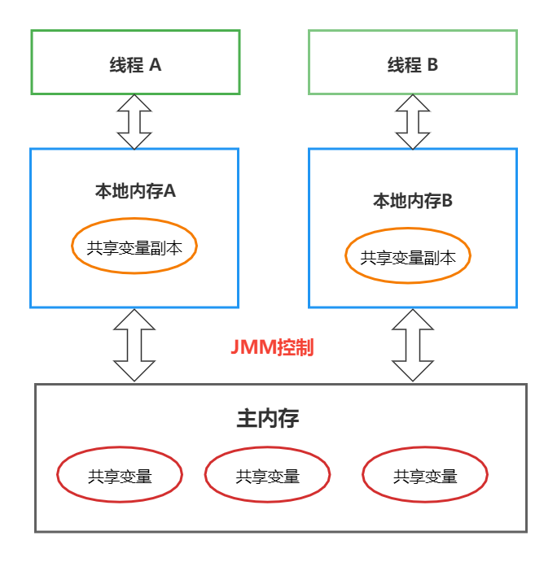

# 谈谈你对Volatile的理解
## 1.Volatile 是Java虚拟机提供的轻量级的同步机制。
- 保证可见性
- **不保证原子性**
- 禁止指令重排

## 2. 谈谈 JMM
### 2.1. 概念：
JMM（Java 内存模型 Java Memory Model）本身是一种抽象的概念并不真实存在，它描述的是一组规则或规范，通过这种规范定义了程序中各个变量（包括实例字段，静态字段和 构成数组对象的元素）的访问方式。

**JMM三大特性**： `可见性`、 `原子性`、`有序性`

### 2.2. JMM 关于同步的规定：
- 线程解锁前，必须把共享变量的值刷新回主内存。
- 线程加锁前，必须读取主内存的最新值到自己的工作内存。
- 加锁解锁是同一把锁。

由于JVM运行程序的实体是线程，而每个线程创建时JVM都会为其创建一个工作内存（有些地方成为栈空间）。<br/>
`主内存`是共享内存区域，所有线程都可以访问，而JAVA内存模型中规定所有变量都存储在主内存。`工作内存`是每个线程的私有数据区域。<br/>
**线程对变量的操作（读取赋值等）必须在工作内存中进行，首先要将变量从主内存拷贝到自己的工作内存空间，然后对变量进行操作，操作完成后再将变量写回主内存**。<br/>
线程不能直接操作主内存的变量，各个线程中的工作内存中存储着变量的副本拷贝，因此不同线程无法访问对方的工作内存， 线程间的通信（传值）必须通过主内存来完成。



**JAVA内存模型的可见性：**

线程A改变了一个共享变量的值，写回主内存，其他线程知道主内存中这个共享变量值已经改变了。当共享变量改变，必须有最新消息第一时间通知其他线程，这个共享的值已经改变了。这种第一时间能够及时通知的机制叫**`JAVA内存模型的可见性`**。


## 3. 原子性
`原子性`：不可分割，完整性。也即某个线程正在做某个具体业务时，中间不可被加塞或者被分割。需要整体完整，要么同时成功，要么同时失败。

### 3.1. Volatile 为什么不能保持原子性？

各个线程对主内存中的共享变量的操作都是各个线程各自拷贝到自己工作内存操作后再写回主内存中。<br/>
这就可能存在线程A修改了共享变量X的值还未写回主内存时，另一线程B又对内存中同一个共享变量X进行操作，但这个时候线程A工作内存中的共享变量X对线程B来说不可见。<br/>
这种工作内存与主内存同步延迟现象就造成了可见性问题。

**例如情况：**
1. 主内存中共享变量 X 的值为0。
2. 线程 A 修改了共享变量 X 的值为1，还未写回主内存时。
3. 另一个线程 B 又对主内存中同一个共享变量 X 进行操作设置为2，但这个时候线程 A 工作内存中的共享变量 X 对线程 B 来说不可见。
4. 这样就可能造成：线程 A 把共享变量 X 的值1写回主内存，而线程 B 也把共享变量 X 的值2写回主线程，会把共享变量 X 的值1覆盖为2。

### 3.2. 怎么解决原子性？
1. 加`synchronized`;
2. number ++ 在多线程下是非线程安全的，如果不加 synchronized解决？
```java
//通过原子类进行解决：AtomicInteger 带原子性的 Integer。(JUC) 代替 number ++。
AtomicInteger i = new AtomicInteger();
```

## 4. 禁止指令重排
### 4.1. 指令重排
`指令重排`：计算机在执行程序时，为了提高性能，编译器和处理器的常常会对指令做重排。
```
源代码 》 编译器优化的重排 》 指令并行的重排 》 内存系统的重排 》 最终执行的指令
```

指令重排有以下三种情况：
1. `单线程环境`里面确保程序最终执行结果和代码顺序执行的结果一致。
2. 处理器在进行重排时必须考虑指令之间的`数据依赖性`。
3. `多线程环境`中线程交替执行，由于编译器优化重排的存在，两个线程中使用的变量能否保证一致性是无法确定的，结果无法预测。


**重排案例一：**
```java
public void my sort(){
    int x = 11;     //语句1
    int y = 12;     //语句2
    x = x + 5;      //语句3
    y = x * x;      //语句4
}

执行顺序：
1234
2134
1324

问题：请问语句4可以重排后成为第一个么？
回答：不可以，因为处理器在进行重排时必须考虑指令之间的数据依赖性。
```

**重排案例二：**
```java
public class Demo{
    int a = 0;
    boolean flag = false;
    
    public void m1(){
        a = 1;          // 语句1
        flag = true;    // 语句2
    }
    
    public void m2(){
        if(flag){
            a = a + 5;  // 语句3
            System.out.println(a);
            // 这个语句如果按照正常执行顺序，只会输出6
        }
    }
}

重排后，线程先执行了 语句2， 执行 m2， 再执行 语句1， 那么输出结果就变为 5，结果就不正确。
```


### 4.2. volatile 禁止指令重排

先了解一个概念，`内存屏障（Memory Barrier）`又称 `内存栅栏` ，是一个CPU命令，它的作用有两个。
1. 保证特定操作的执行顺序。
2. 是保证某些变量的内存可见性（利用该特性实现volatile的内存可见性）

由于编译器和处理器都执行指令重排优化。如果在指令间插入一条Memory Barrier 则告诉编译器和CPU，不管什么指令都不能和这条Memorry Barrier指令重排序，也就是说**通过插入内存屏障禁止内存屏障前后的指令执行重排序优化**。<br/>
内存屏障另外一个作用是**强制刷出各种CPU的缓冲数据，因此任何CPU上的线程都能读取到这些数据的最新版本。**（可见性）

**总结：volatile 实现禁止指令重排优化，从而避免多线程环境下程序出现乱序执行现象。**

### 4.3. 安全性得到保障

工作内存与主内存同步延迟现象导致的**可见性问题**，可以使用`synchronized`或`volatile`关键字解决，他们都可以是一个线程**修改后的变量立即对其他线程可见**。<br/>

**对于指令重排导致的可见性问题或有序性问题**，可以利用volatile关键字解决，因为volatile的另外一个作用就是禁止重排序优化。


## 5. 单例模式Volatile
**DCL模式（Double Check Lock 双端检锁模式）**：加锁并两次检测
```java
public class Singleton{ 
    private static Singleton INSTANCE = null;
    
    private Singleton(){
        
    }
    
    //DCL模式（Double Check Lock 双端检锁模式）
    public static Singleton getInstance(){
        if(INSTANCE == NULL){
            synchronized(Singleton.class){
                if(INSTANCE == NULL){
                    INSTANCE  = new Singleton();
                }
            }
        }
        return INSTANCE;
    }   
}
```

DCL（双端检锁）机制不一定线程安全，原因是有指令重排序的存在，加入volatile可以禁止指令重排。

原因在于：某一线程执行到第一次检测，读到 INSTANCE 不为 null 时，`INSTANCE 的引用对象可能没有完成初始化`。

**原因如下：**
```java
INSTANCE  = new Singleton();    // 可以分为以下3步完成（伪代码）
memory = allocate(); 	        // 1. 分配对象内存空间。
instance(memory);               // 2. 初始化对象。
instance= memory;               // 3. 设置INSTANCE 指向 刚分配的内存地址，此时 instance !=  null。
```

步骤2 和步骤3 **不存在数据依赖关系**，而且**无论重排前还是重排后程序执行结果在单线程中并没有改变**，因此这种重排优化是允许的。

```java
memory = allocate();            // 1. 分配对象内存空间。
instance= memory;               // 3. 设置INSTANCE 指向 刚分配的内存地址，此时 instance !=  null，但是对象还未初始化完成！
instance(memory);               // 2.初始化对象。
```

指令重排只会保证串行语义的执行的一致性（单线程），但不会关系多线程的语义一致性。

**所以当其中一条线程访问 INSTANCE 不为 null 时，由于INSTANCE 实例还未初始化完成，也就造成了线程安全问题。
可以给代码加vlatile 禁止指令重排。**

```java
private static volatile Singleton INSTANCE = null;
```
